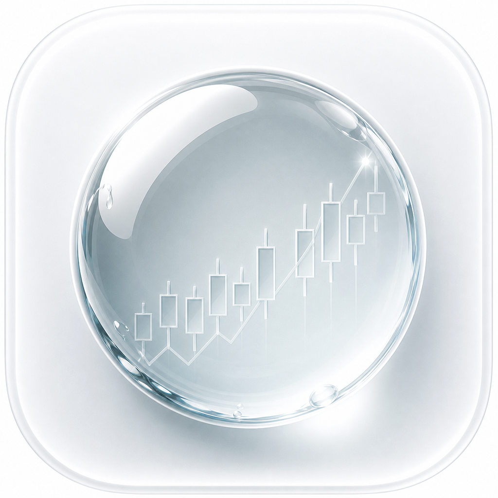
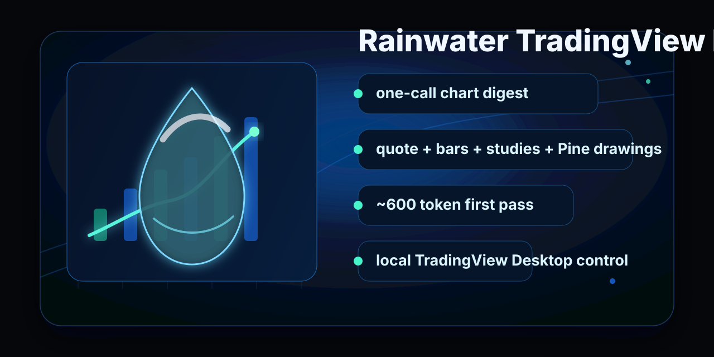
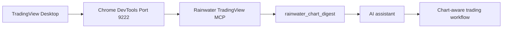

<div align="center">
  

  <h1>Rainwater TradingView MCP</h1>

  <p>
    <strong>AI-readable TradingView context, built for fast local chart workflows.</strong><br>
    One compact MCP call can read chart state, quote, OHLC summary, visible studies, Pine levels, zones, labels, speed, and estimated token cost.
  </p>

  <p>
    <a href="#quick-start">Quick Start</a> |
    <a href="#rainwater-context">Rainwater Context</a> |
    <a href="#tool-reference-83-mcp-tools">Tools</a> |
    <a href="#troubleshooting">Troubleshooting</a>
  </p>

  <p>
    
    
    
    
  </p>
</div>

<p align="center">
  
</p>

Rainwater TradingView MCP is a Rainwater-maintained fork focused on token-efficient chart context, stable TradingView Desktop control, and repeatable AI-assisted trading research. It keeps the workflow local: your AI client talks to this MCP server, this MCP server talks to your own TradingView Desktop app over Chrome DevTools Protocol, and the response is shaped for agent use.

> [!WARNING]
> **Not affiliated with TradingView Inc. or Anthropic.** This tool connects to your locally running TradingView Desktop app via Chrome DevTools Protocol. Review the [Disclaimer](#disclaimer) before use.

> [!IMPORTANT]
> **Requires a valid TradingView subscription.** This tool does not bypass any TradingView paywall. It reads from and controls the TradingView Desktop app already running on your machine.

> [!NOTE]
> **All data processing happens locally.** Nothing is sent anywhere. No TradingView data leaves your machine.

---

## Rainwater Context



The default first read is `rainwater_chart_digest`: it compresses the expensive first-pass chart inspection into one bounded payload.
Use `mode: "lite"` for the smallest context, `mode: "standard"` for the default Rainwater read, and `mode: "full"` when you explicitly want tables and deeper drawing context.

$$estimated\_tokens \approx \lceil output\_bytes / 4 \rceil$$

<details>
<summary>What the digest includes</summary>

- Symbol, timeframe, chart type, and visible studies
- Latest quote from the active chart
- OHLC summary over a bounded bar window
- Last three bars for immediate context
- Study values from the data window
- Pine `line.new`, `label.new`, and `box.new` outputs for levels, annotations, and zones
- `elapsed_ms`, `output_bytes`, `estimated_tokens`, and soft `budget_tokens` trimming metadata

</details>

---

## Why Rainwater

| Rainwater layer | Why it matters |
|-----------------|----------------|
| Compact chart digest | Replaces the slow first pass of separate state, quote, OHLC, study, line, label, box, and table reads with one bounded response |
| Token budgeting | `lite`, `standard`, `full`, and `budget_tokens` keep responses predictable for AI agents |
| Stability hardening | CDP timeouts, reconnects, lifecycle cleanup, and a cross-process evaluate lock reduce hangs when TradingView Desktop gets busy |
| Daily workflow | `morning_brief`, `rules.json`, and session saves turn chart reads into a repeatable trading prep loop |
| Local-first operation | No hosted backend, no external data relay, no TradingView credential collection |

---

## What's New in This Fork

| Feature | What it does |
|---------|-------------|
| `rainwater_chart_digest` | One compact first-pass read of the active chart. Live NQ tests returned about 600-700 estimated tokens while replacing roughly seven separate reads |
| Digest budget modes | `lite`, `standard`, `full`, and `budget_tokens` keep Rainwater reads predictable |
| Runtime hardening | Bounded CDP timeouts, automatic reconnect, lifecycle cleanup, duplicate-process diagnostics, and a shared evaluate lock |
| `morning_brief` | One command that scans your watchlist, reads all your indicators, and returns structured data for Claude to generate your session bias |
| `session_save` / `session_get` | Saves your daily brief to `~/.tradingview-mcp/sessions/` so you can compare today vs yesterday |
| `rules.json` | Write your trading rules once — bias criteria, risk rules, watchlist. The morning brief applies them automatically every day |
| `tv doctor` | One command to diagnose install paths, MCP config, duplicate processes, TradingView state, CDP health, and stale client schemas |
| Launch bug fix | Fixed `tv_launch` compatibility with current TradingView Desktop behavior |
| `tv brief` CLI | Run your morning brief from the terminal in one word |

---

## One-Shot Setup

Paste this into Claude Code and it will handle everything:

```
Set up Rainwater TradingView MCP for me.
Clone https://github.com/rainwaterlogic/rainwater-tradingview-mcp.git to ~/rainwater-tradingview-mcp, run npm install, then add it to my MCP config at ~/.claude/.mcp.json (merge with any existing servers, don't overwrite them).
The config block is: { "mcpServers": { "tradingview": { "command": "node", "args": ["/Users/YOUR_USERNAME/rainwater-tradingview-mcp/src/server.js"] } } } — replace YOUR_USERNAME with my actual username.
Then copy rules.example.json to rules.json and open it so I can fill in my trading rules.
Finally restart and verify with tv_health_check.
```

Or follow the manual steps below.

---

## Prerequisites

- **TradingView Desktop app** (paid subscription required for real-time data)
- **Node.js 18+**
- **Claude Code** (for MCP tools) or any terminal (for CLI)
- **macOS, Windows, or Linux**

---

## Quick Start

### 1. Clone and install

```bash
git clone https://github.com/rainwaterlogic/rainwater-tradingview-mcp.git ~/rainwater-tradingview-mcp
cd ~/rainwater-tradingview-mcp
npm install
```

### 2. Set up your rules

```bash
cp rules.example.json rules.json
```

Open `rules.json` and fill in:
- Your **watchlist** (symbols to scan each morning)
- Your **bias criteria** (what makes something bullish/bearish/neutral for you)
- Your **risk rules** (the rules you want Claude to check before every session)

### 3. Launch TradingView with CDP

TradingView must be running with the debug port enabled.

**Mac:**
```bash
./scripts/launch_tv_debug_mac.sh
```

**Windows:**
```bash
scripts\launch_tv_debug.bat
```

**Linux:**
```bash
./scripts/launch_tv_debug_linux.sh
```

Or use the MCP tool after setup: `"Use tv_launch to start TradingView in debug mode"`

### 4. Add to Claude Code

Add to `~/.claude/.mcp.json` (merge with any existing servers):

```json
{
  "mcpServers": {
    "tradingview": {
      "command": "node",
      "args": ["/Users/YOUR_USERNAME/rainwater-tradingview-mcp/src/server.js"]
    }
  }
}
```

Replace `YOUR_USERNAME` with your actual username. On Mac: `echo $USER` to check.

### 5. Verify

Restart Claude Code, then ask: *"Use tv_health_check to verify TradingView is connected"*

### 6. Run your first morning brief

Ask Claude: *"Run morning_brief and give me my session bias"*

Or from the terminal:
```bash
npm link  # install tv CLI globally (one time)
tv brief
```

---

## Morning Brief Workflow

This is the feature that turns this from a toolkit into a daily habit.

**Before every session:**

1. TradingView is open (launched with debug port)
2. Run: `tv brief` in your terminal (or ask Claude: *"run morning_brief"*)
3. Claude scans every symbol in your watchlist, reads your indicator values, applies your `rules.json` criteria, and prints:

```
BTCUSD  | BIAS: Bearish  | KEY LEVEL: 94,200  | WATCH: RSI crossing 50 on 4H
ETHUSD  | BIAS: Neutral  | KEY LEVEL: 3,180   | WATCH: Ribbon direction on daily
SOLUSD  | BIAS: Bullish  | KEY LEVEL: 178.50  | WATCH: Hold above 20 EMA

Overall: Cautious session. BTC leading bearish, SOL the exception — watch for divergence.
```

4. Save it: *"save this brief"* (uses `session_save`)
5. Next morning, compare: *"get yesterday's session"* (uses `session_get`)

---

## What This Tool Does

- **Morning brief** — scan watchlist, read indicators, apply your rules, print session bias
- **Pine Script development** — write, inject, compile, debug scripts with AI
- **Chart navigation** — change symbols, timeframes, zoom to dates, add/remove indicators
- **Visual analysis** — read indicator values, price levels, drawn levels from custom indicators
- **Draw on charts** — trend lines, horizontal levels, rectangles, text
- **Manage alerts** — create, list, delete price alerts
- **Replay practice** — step through historical bars, practice entries and exits with P&L tracking
- **Screenshots** — capture chart state
- **Multi-pane layouts** — 2x2, 3x1 grids with different symbols per pane
- **Stream data** — JSONL output from your live chart for monitoring scripts
- **CLI access** — every tool is also a `tv` command, pipe-friendly JSON output

---

## How Claude Knows Which Tool to Use

Claude reads `CLAUDE.md` automatically when working in this project. It contains the full decision tree.

| You say... | Claude uses... |
|------------|---------------|
| "Run my morning brief" | `morning_brief` → apply rules → `session_save` |
| "What was my bias yesterday?" | `session_get` |
| "What's on my chart?" | `rainwater_chart_digest` |
| "Give me a full analysis" | `quote_get` → `data_get_study_values` → `data_get_pine_lines` → `data_get_pine_labels` → `capture_screenshot` |
| "Switch to BTCUSD daily" | `chart_set_symbol` → `chart_set_timeframe` |
| "Write a Pine Script for..." | `pine_set_source` → `pine_smart_compile` → `pine_get_errors` |
| "Start replay at March 1st" | `replay_start` → `replay_step` → `replay_trade` |
| "Set up a 4-chart grid" | `pane_set_layout` → `pane_set_symbol` |
| "Draw a level at 94200" | `draw_shape` (horizontal_line) |

---

## Tool Reference (83 MCP tools)

### Rainwater Context

| Tool | What it does |
|------|-------------|
| `rainwater_chart_digest` | One compact first-pass read of the active chart: state, quote, OHLC summary, study values, Pine levels/zones/labels, elapsed time, output bytes, and estimated tokens. Use `mode: "lite" \| "standard" \| "full"`, `budget_tokens`, `study_filter`, and `max_items` to keep context tight. |

### Morning Brief (new in this fork)

| Tool | What it does |
|------|-------------|
| `morning_brief` | Scan watchlist, read indicators, return structured data for session bias. Reads `rules.json` automatically. |
| `session_save` | Save the generated brief to `~/.tradingview-mcp/sessions/YYYY-MM-DD.json` |
| `session_get` | Retrieve today's brief (or yesterday's if today not saved yet) |

### Chart Reading

| Tool | When to use | Output size |
|------|------------|-------------|
| `rainwater_chart_digest` | First-pass Rainwater analysis in one call | `lite`, `standard`, `full`, and `budget_tokens` |
| `chart_get_state` | First call — get symbol, timeframe, all indicator names + IDs | ~500B |
| `data_get_study_values` | Read current RSI, MACD, BB, EMA values from all indicators | ~500B |
| `quote_get` | Get latest price, OHLC, volume | ~200B |
| `data_get_ohlcv` | Get price bars. **Use `summary: true`** for compact stats | 500B (summary) / 8KB (100 bars) |

### Custom Indicator Data (Pine Drawings)

Read `line.new()`, `label.new()`, `table.new()`, `box.new()` output from any visible Pine indicator.

| Tool | When to use |
|------|------------|
| `data_get_pine_lines` | Horizontal price levels (support/resistance, session levels) |
| `data_get_pine_labels` | Text annotations + prices ("PDH 24550", "Bias Long") |
| `data_get_pine_tables` | Data tables (session stats, analytics dashboards) |
| `data_get_pine_boxes` | Price zones as {high, low} pairs |

**Always use `study_filter`** to target a specific indicator: `study_filter: "MyIndicator"`.

### Chart Control

| Tool | What it does |
|------|-------------|
| `chart_set_symbol` | Change ticker (BTCUSD, AAPL, ES1!, NYMEX:CL1!) |
| `chart_set_timeframe` | Change resolution (1, 5, 15, 60, D, W, M) |
| `chart_set_type` | Change style (Candles, HeikinAshi, Line, Area, Renko) |
| `chart_manage_indicator` | Add/remove indicators. **Use full names**: "Relative Strength Index" not "RSI" |
| `chart_scroll_to_date` | Jump to a date (ISO: "2025-01-15") |
| `indicator_set_inputs` / `indicator_toggle_visibility` | Change indicator settings, show/hide |

### Pine Script Development

| Tool | Step |
|------|------|
| `pine_set_source` | 1. Inject code into editor |
| `pine_smart_compile` | 2. Compile with auto-detection + error check |
| `pine_get_errors` | 3. Read compilation errors if any |
| `pine_get_console` | 4. Read log.info() output |
| `pine_save` | 5. Save to TradingView cloud |
| `pine_analyze` | Offline static analysis (no chart needed) |
| `pine_check` | Server-side compile check (no chart needed) |

### Replay Mode

| Tool | Step |
|------|------|
| `replay_start` | Enter replay at a date |
| `replay_step` | Advance one bar |
| `replay_autoplay` | Auto-advance (set speed in ms) |
| `replay_trade` | Buy/sell/close positions |
| `replay_status` | Check position, P&L, date |
| `replay_stop` | Return to realtime |

### Multi-Pane, Alerts, Drawings, UI

| Tool | What it does |
|------|-------------|
| `pane_set_layout` | Change grid: `s`, `2h`, `2v`, `2x2`, `4`, `6`, `8` |
| `pane_set_symbol` | Set symbol on any pane |
| `draw_shape` | Draw horizontal_line, trend_line, rectangle, text |
| `alert_create` / `alert_list` / `alert_delete` | Manage price alerts |
| `batch_run` | Run action across multiple symbols/timeframes |
| `watchlist_get` / `watchlist_add` | Read/modify watchlist |
| `capture_screenshot` | Screenshot (regions: full, chart, strategy_tester) |
| `tv_launch` / `tv_health_check` | Launch TradingView and verify connection |
| `tv_mcp_runtime_status` | Report MCP PID, parent PID, memory, sibling server count, lifecycle guards, and CDP listening state |

---

## CLI Commands

```bash
tv brief                           # run morning brief
tv session get                     # get today's saved brief
tv session save --brief "..."      # save a brief

tv doctor                          # diagnose install/runtime/CDP issues
tv status                          # check connection
tv quote                           # current price
tv symbol BTCUSD                   # change symbol
tv ohlcv --summary                 # price summary
tv screenshot -r chart             # capture chart
tv pine compile                    # compile Pine Script
tv pane layout 2x2                 # 4-chart grid
tv stream quote | jq '.close'      # monitor price ticks
```

Full command list: `tv --help`

---

## Troubleshooting

| Problem | Solution |
|---------|----------|
| Unsure what is broken | Run `tv doctor` first. It checks Node, MCP configs, duplicate server processes, TradingView, CDP, and stale client schema symptoms. |
| `cdp_connected: false` | TradingView isn't running with `--remote-debugging-port=9222`. Use the launch script. |
| `ECONNREFUSED` | TradingView isn't running or port 9222 is blocked |
| Client still shows 78 tools | Restart Codex/Claude so it reloads the 83-tool Rainwater MCP schema. |
| MCP server not showing in Claude Code | Check `~/.claude/.mcp.json` syntax, restart Claude Code |
| `tv` command not found | Run `npm link` from the project directory |
| `morning_brief` — "No rules.json found" | Run `cp rules.example.json rules.json` and fill it in |
| `morning_brief` — watchlist empty | Add symbols to the `watchlist` array in `rules.json` |
| Tools return stale data | TradingView still loading — wait a few seconds |
| Tool call times out | TradingView may be busy or its renderer may have crashed. The MCP resets the CDP connection; run `tv doctor`, then `tv launch` if CDP is down. |
| Pine Editor tools fail | Open Pine Editor panel first: `ui_open_panel pine-editor open` |

---

## Architecture

```
Claude Code  ←→  MCP Server (stdio)  ←→  CDP (port 9222)  ←→  TradingView Desktop (Electron)
```

- **83 MCP tools** including Rainwater compact context, runtime status, morning brief, Pine, chart, replay, drawing, and UI tools
- **Transport**: MCP over stdio + CLI (`tv` command)
- **Connection**: Chrome DevTools Protocol on localhost:9222
- **No external network calls** — everything runs locally
- **Lifecycle guards**: signal cleanup, stdin-close cleanup, parent-death watch, and optional `TV_MCP_IDLE_EXIT_MS`
- **Stability guards**: serialized CDP evaluations, a cross-process evaluate lock for duplicate MCP servers, bounded connect/evaluate timeouts, and automatic CDP reconnect after renderer timeouts. Tune with `TV_MCP_EVALUATE_TIMEOUT_MS`, `TV_MCP_EVALUATE_ASYNC_TIMEOUT_MS`, `TV_MCP_EVALUATE_COOLDOWN_MS`, and `TV_MCP_GLOBAL_LOCK=0` if you need to disable the shared lock.

---

## Contributing

Rainwater welcomes focused improvements that make the MCP more reliable, more token-efficient, or easier to install.

- Read [CONTRIBUTING.md](CONTRIBUTING.md) before opening a PR
- Use the GitHub issue templates for bugs and feature requests
- Include `tv doctor` output when reporting runtime issues
- Keep market data local and respect the project scope in [SECURITY.md](SECURITY.md)

---

## Credits

This fork is built on [tradingview-mcp](https://github.com/tradesdontlie/tradingview-mcp) by [@tradesdontlie](https://github.com/tradesdontlie). The original tool is the foundation — go star their repo.

---

## Disclaimer

This project is provided **for personal, educational, and research purposes only**.

This tool uses the Chrome DevTools Protocol (CDP), a standard debugging interface built into all Chromium-based applications. It does not reverse engineer any proprietary TradingView protocol, connect to TradingView's servers, or bypass any access controls. The debug port must be explicitly enabled by the user via a standard Chromium command-line flag.

By using this software you agree that:

1. You are solely responsible for ensuring your use complies with [TradingView's Terms of Use](https://www.tradingview.com/policies/) and all applicable laws.
2. This tool accesses undocumented internal TradingView APIs that may change at any time.
3. This tool must not be used to redistribute, resell, or commercially exploit TradingView's market data.
4. The authors are not responsible for any account bans, suspensions, or other consequences.

**Use at your own risk.**

## License

MIT — see [LICENSE](LICENSE). Applies to source code only, not to TradingView's software, data, or trademarks.
